<p align="center">
  
</p>

<h1 align="center">🎨 Material Nova — Premium VS Code Theme</h1>

<p align="center">
  <strong>A premium, modern VS Code theme built on Google's legendary Material Design palette.</strong><br />
  Designed as the ultimate, modern alternative to <strong>Community Material Theme</strong>, <strong>One Dark Pro</strong>, <strong>Dracula</strong>, <strong>Ayu</strong>, and <strong>Tokyo Night</strong>. Enjoy refined aesthetics, tailored high-contrast accents, and pixel-perfect semantic highlighting for the ultimate developer experience.
</p>

<p align="center">
  
  
  
  
</p>


---

## 🌟 Why Material Nova?

Material Nova is not just another color scheme. It is an meticulously engineered workspace designed to reduce cognitive load and enhance your focus during intense coding sessions.

*   🚀 **Semantic Highlighting:** Deeply optimized syntax highlighting rules for Javascript, TypeScript, React (TSX/JSX), Python, C#, HTML/CSS, and JSON.
*   👀 **Reduced Eye Strain:** Carefully selected color contrast ratios conforming to WCAG standards, preventing fatigue during late-night debugging.
*   📦 **19 Distinct Variants:** Access classic dark, deep space Nebula, soft cherry Sakura, retro warm Gruvbox, vibrant purple Palenight, marine Ocean, organic Forest, glowing Synthwave, and crisp Lighter layouts instantly.
*   🌈 **High Contrast Mode Included:** Every single dark variant has a sister "High Contrast" edition for developers who prefer sharp borders and high visibility.
*   ⚡ **Zero Performance Impact:** Hand-crafted pure JSON declarations with no background scripts, ensuring your VS Code editor opens and runs instantly.

---

## 🎨 Theme Variants Reference

Explore a carefully curated set of 19 premium variants tailored to your environmental lighting and style:

| Variant Name | Background | Foreground | Ideal Use Case |
| :--- | :---: | :---: | :--- |
| **Material Nova Default** | `#263238` | `#EEFFFF` | The classic Google Material experience. |
| **Material Nova Default HC** | `#1A2327` | `#FFFFFF` | Extra borders and sharp, clear contrasts. |
| **Material Nova Darker** | `#212121` | `#EEFFFF` | Ultimate night coding, deep matte gray layout. |
| **Material Nova Darker HC** | `#121212` | `#FFFFFF` | True OLED pitch-black screen experience. |
| **Material Nova Palenight** | `#292D3E` | `#BABED8` | Vibrant purple-blue synthwave aesthetic. |
| **Material Nova Palenight HC** | `#1B1E2B` | `#FFFFFF` | Extra crisp synthwave feel. |
| **Material Nova Ocean** | `#0F111A` | `#BABED8` | Calming deep-sea navy layout. |
| **Material Nova Ocean HC** | `#08090E` | `#FFFFFF` | Ultra-dark marine coding. |
| **Material Nova Deepforest** | `#141F1D` | `#C2EDD3` | Organic dark forest green comfort. |
| **Material Nova Deepforest HC** | `#0D1413` | `#FFFFFF` | Rich organic high-contrast layout. |
| **Material Nova Lighter** | `#FAFAFA` | `#90A4AE` | Perfect for bright daylight or outdoor offices. |
| **Material Nova Lighter HC** | `#FFFFFF` | `#263238` | Maximum daylight visibility. |
| **Material Nova Sakura** | `#1D1921` | `#E3D6DF` | Premium cherry blossom-inspired layout. |
| **Material Nova Nebula** | `#12101E` | `#E1DFEE` | Premium celestial deep space dark theme. |
| **Material Nova Nebula HC** | `#09080F` | `#FFFFFF` | OLED pitch-black deep space theme. |
| **Material Nova Gruvbox** | `#282828` | `#FBF1C7` | Warm retro-analog cozy theme to reduce eye fatigue. |
| **Material Nova Gruvbox HC** | `#1D2021` | `#FFFFFF` | High-contrast dark Gruvbox OLED variant. |
| **Material Nova Synthwave** | `#261435` | `#E1DFEE` | Glowing neon cyberpunk/synthwave aesthetic. |
| **Material Nova Synthwave HC** | `#180B22` | `#FFFFFF` | Pitch-black neon OLED space theme. |

---

## 📸 Visual Previews & Gallery

### Material Nova Default
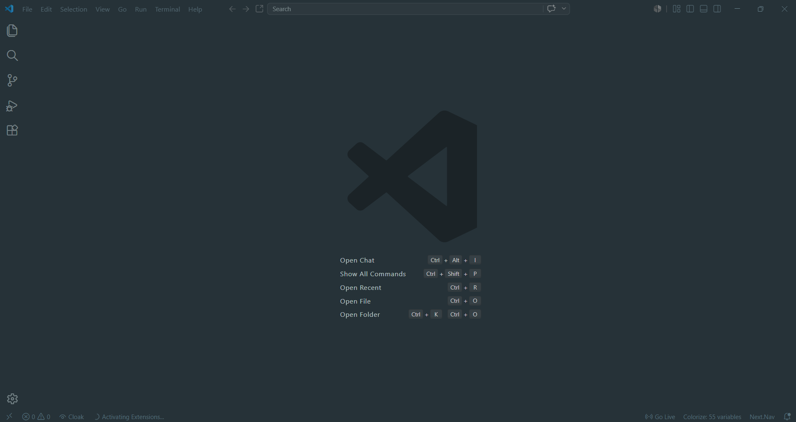

### Material Nova Default High Contrast
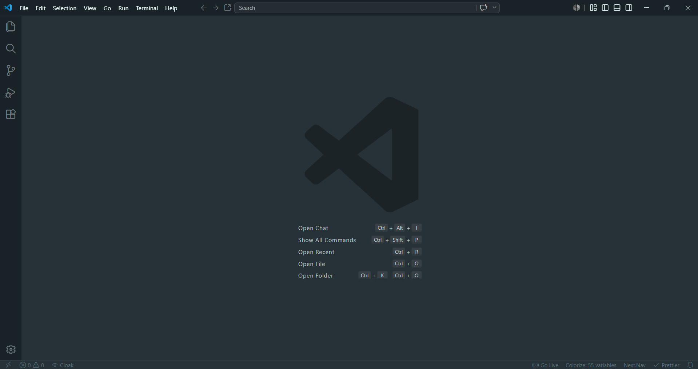

### Material Nova Darker
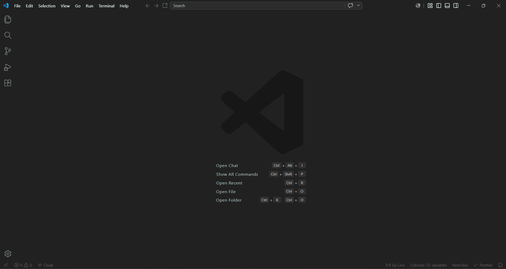

### Material Nova Darker High Contrast
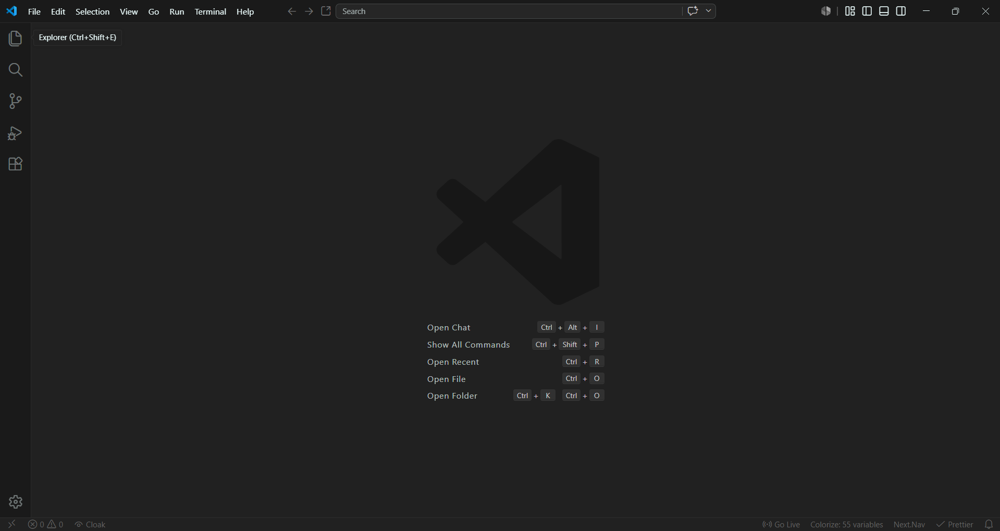

### Material Nova Palenight
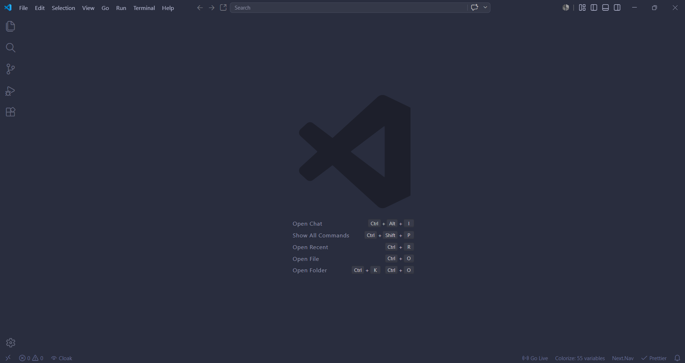

### Material Nova Palenight High Contrast
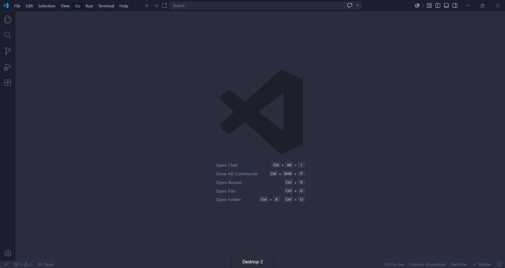

### Material Nova Ocean
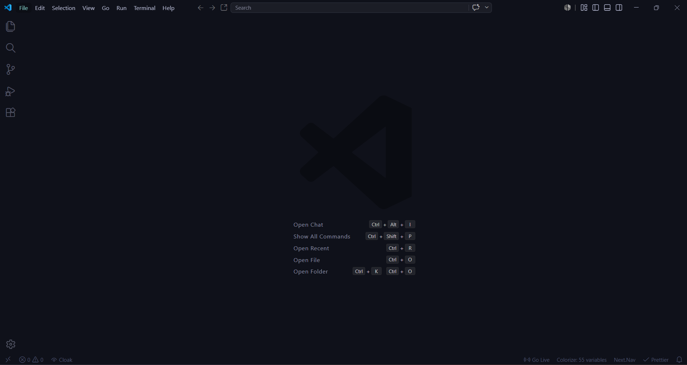

### Material Nova Ocean High Contrast
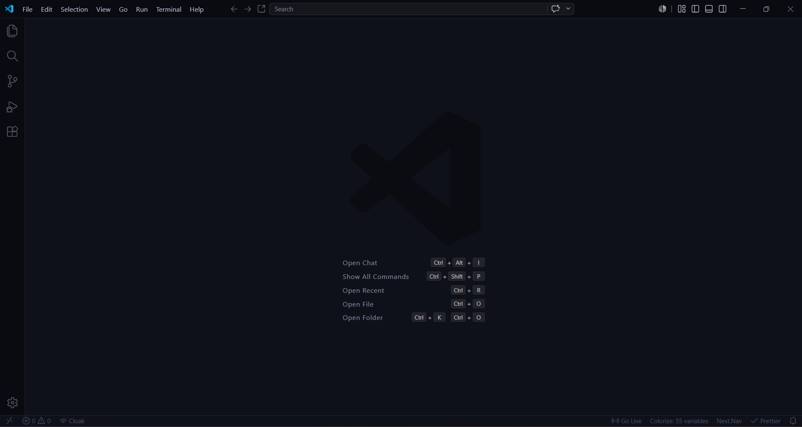

### Material Nova Deepforest
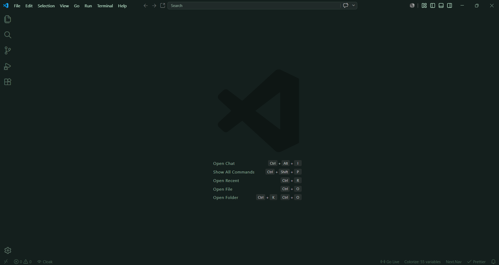

### Material Nova Deepforest High Contrast
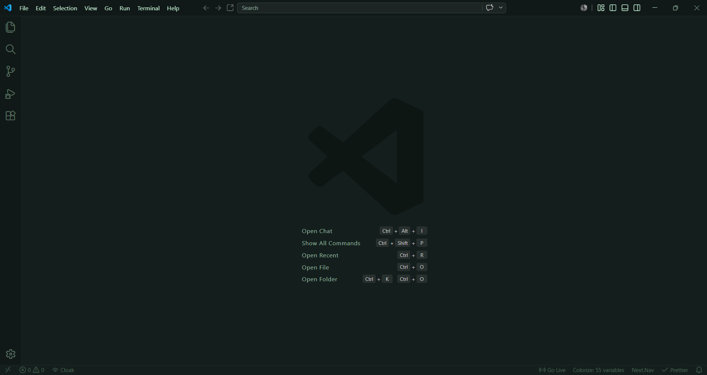

### Material Nova Sakura
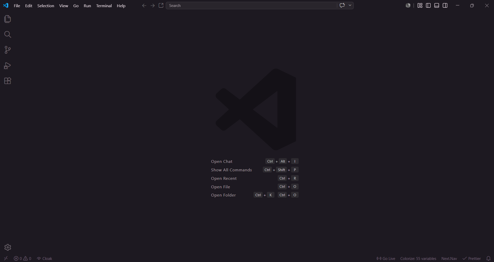

### Material Nova Nebula
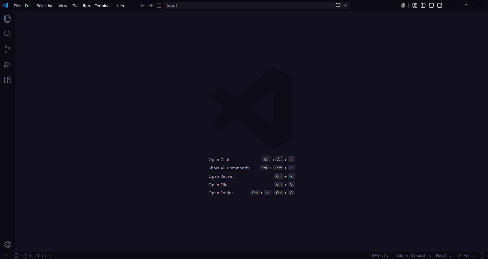

### Material Nova Nebula High Contrast
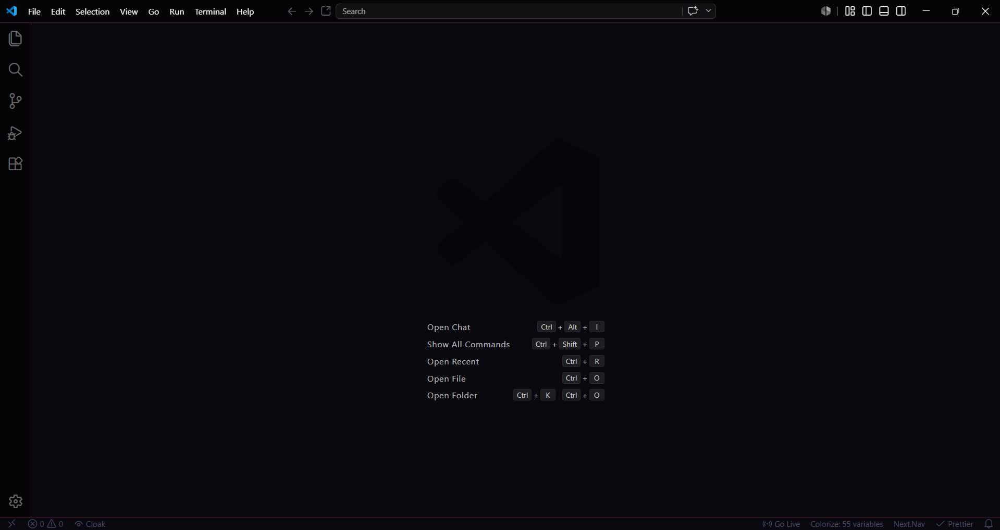

### Material Nova Gruvbox
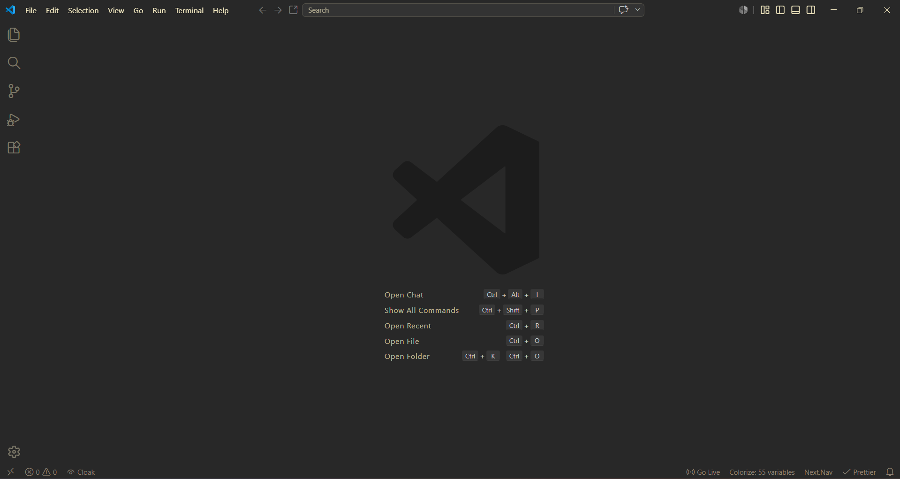

### Material Nova Gruvbox High Contrast
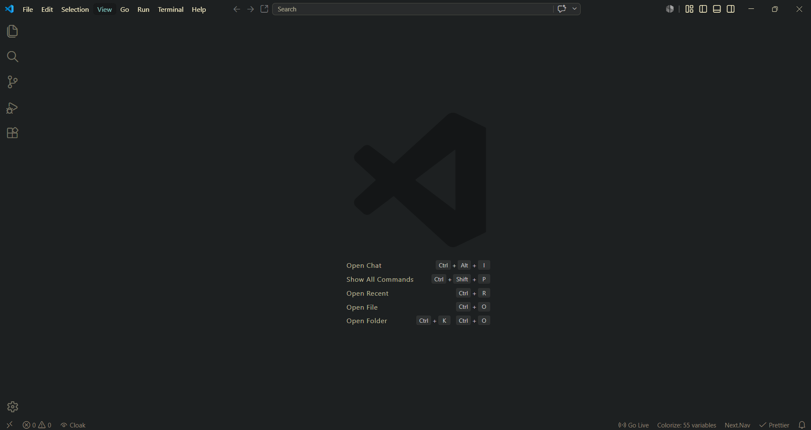

### Material Nova Synthwave
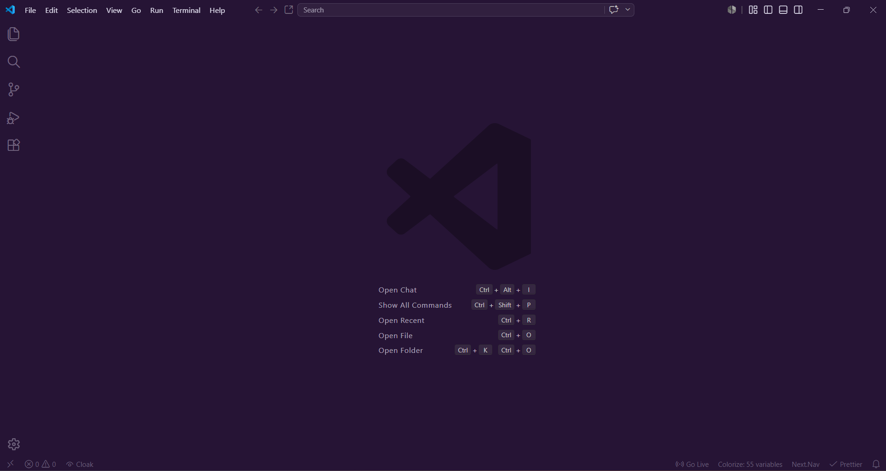

### Material Nova Synthwave High Contrast
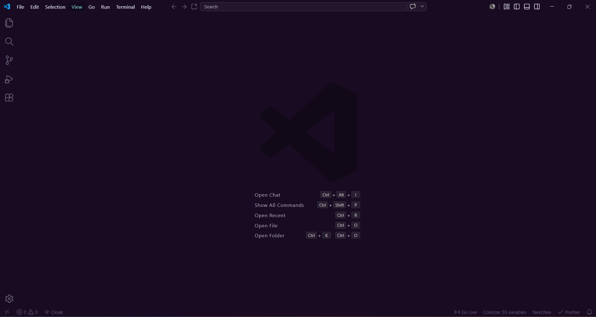

### Material Nova Lighter
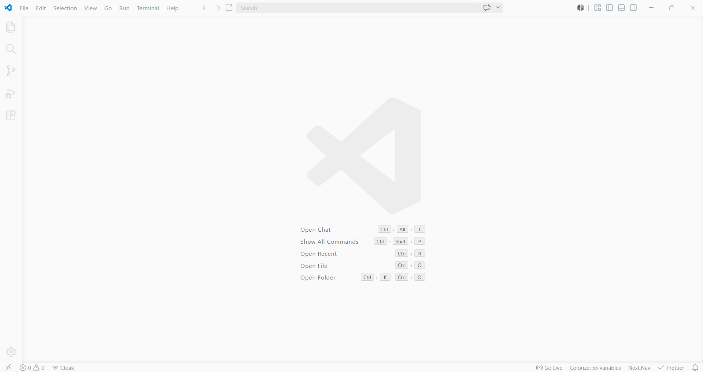

### Material Nova Lighter High Contrast
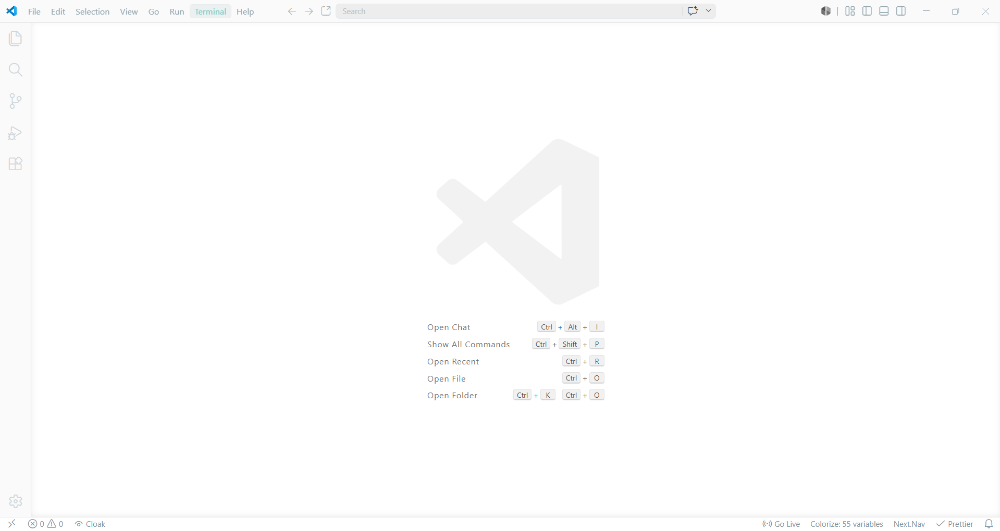

---

## 🚀 Quick Setup & Installation

Follow these simple steps to activate Material Nova:

1. Open your **VS Code** editor.
2. Go to the Extensions panel (`Ctrl+Shift+X` or `Cmd+Shift+X`).
3. Search for **`Material Nova`** and click **Install**.
4. Press `Ctrl+K` then `Ctrl+T` (or `Cmd+K` then `Cmd+T`) to open the theme selection.
5. Choose your favorite **Material Nova** variant from the drop-down list!

---

## ⚙️ Recommended Settings

For the ultimate experience, we recommend using these typography and rendering options in your `settings.json`:

```json
{
  "editor.fontFamily": "JetBrains Mono, Fira Code, monospace",
  "editor.fontSize": 14,
  "editor.lineHeight": 1.6,
  "editor.letterSpacing": 0.5,
  "editor.fontLigatures": true,
  "editor.cursorBlinking": "smooth",
  "editor.cursorSmoothCaretAnimation": "on"
  // Tip: Combine with 'Material Icon Theme' or 'Dracula Icons' for a complete setup!
}
```

---

## 📢 What's New in v2.3.1

*   📸 **Complete Visual Previews Gallery**: Included 19 high-definition screenshot files inside the `images/` directory and rendered them directly inside the `README.md` for a breathtaking visual showcase.
*   🪵 **Gruvbox & Synthwave Previews**: Added gorgeous screenshots for our newly launched vintage Gruvbox and glowing neon Synthwave themes.
*   🎨 **Sleek Layout Adjustments**: Aligned formatting and assets for maximum visual appeal on the VS Code Marketplace.

---

## 👨‍💻 Designed & Developed By

This extension is crafted with passion by:

**Dhaval Kurkutiya**
*   🌐 **Portfolio:** [dhavalkurkutiya.dev](https://dhavalkurkutiya.dev)
*   🐙 **GitHub:** [@Dhavalkurkutiya](https://github.com/Dhavalkurkutiya)
*   💼 **LinkedIn:** [dhavalkurkutiya](https://www.linkedin.com/in/dhavalkurkutiya/)

---

## 📄 License

This project is licensed under the [MIT License](LICENSE.txt) — feel free to customize and enjoy!

<p align="center">Made with ❤️ by Dhaval Kurkutiya</p>
